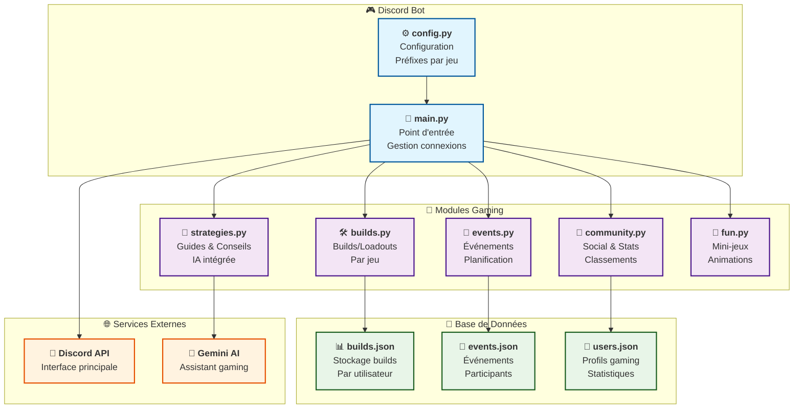

# 🏗️ Architecture MonBotGaming

## 📊 Schéma Visual de l'Architecture

## 🎯 Description des Composants

### 🔧 Core Bot
- **main.py** : Point d'entrée, gère la connexion Discord
- **config.py** : Configuration centralisée (préfixes, channels, jeux)

### 🎮 Modules Gaming
- **builds.py** : Gestion des builds/loadouts par jeu
- **events.py** : Planification d'événements gaming
- **strategies.py** : Guides et conseils avec IA
- **community.py** : Système social et stats
- **fun.py** : Mini-jeux et animations

### 💾 Données
- **builds.json** : Stockage des builds par jeu et utilisateur
- **events.json** : Événements planifiés et participants
- **users.json** : Profils gaming et statistiques

### 🌐 Services Externes
- **Discord API** : Interface principale avec Discord
- **Gemini AI** : Assistant IA pour conseils gaming

## 🔄 Flux de Données

1. **Utilisateur** → **Discord** → **main.py**
2. **main.py** → **Module approprié** (builds, events, etc.)
3. **Module** → **Base de données JSON** (lecture/écriture)
4. **Module** → **Service externe** (si nécessaire)
5. **Réponse** → **Discord** → **Utilisateur**

## 📝 Jeux Supportés

### 🎯 Stratégie/RPG
- Space Marine II, Baldur's Gate 3, Diablo I-IV
- WoW Classic/Retail, Valheim, Enshrouded

### 🔫 Action/FPS
- Escape from Tarkov, Helldivers 2

### 🎲 Multijoueur
- League of Legends, Rocket League, Sea of Thieves
- MTG Arena, Raft, Waven

### 🎭 Roleplay
- JDR (Jeu de Rôle) avec générateurs d'événements
